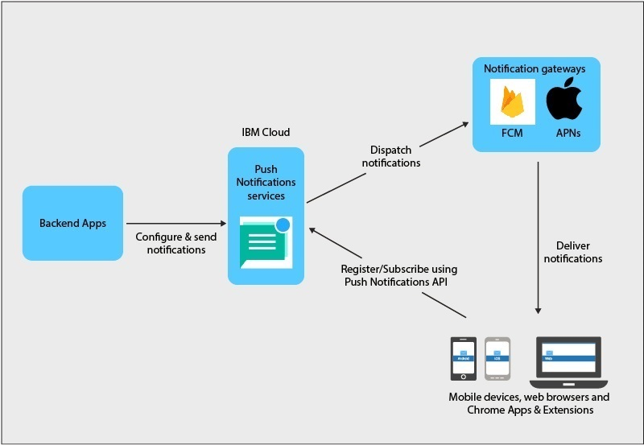

---

copyright:
  years: 2015, 2020
lastupdated: "2020-04-21"

keywords: push notifications, notifications, service credentials, service processes, push message size, regional high availability

subcollection: mobile-pushnotification

---

{:external: target="_blank" .external}
{:shortdesc: .shortdesc}
{:codeblock: .codeblock}
{:pre: .pre}
{:screen: .screen}
{:tsSymptoms: .tsSymptoms}
{:tsCauses: .tsCauses}
{:tsResolve: .tsResolve}
{:tip: .tip}
{:important: .important}
{:note: .note}
{:download: .download}
{:java: .ph data-hd-programlang='java'}
{:ruby: .ph data-hd-programlang='ruby'}
{:c#: .ph data-hd-programlang='c#'}
{:objectc: .ph data-hd-programlang='Objective C'}
{:python: .ph data-hd-programlang='python'}
{:javascript: .ph data-hd-programlang='javascript'}
{:php: .ph data-hd-programlang='PHP'}
{:swift: .ph data-hd-programlang='swift'}
{:reactnative: .ph data-hd-programlang='React Native'}
{:csharp: .ph data-hd-programlang='csharp'}
{:ios: .ph data-hd-programlang='iOS'}
{:android: .ph data-hd-programlang='Android'}
{:cordova: .ph data-hd-programlang='Cordova'}
{:xml: .ph data-hd-programlang='xml'}

# About {{site.data.keyword.mobilepushshort}} 
{: #gettingstartedtemplate}

{{site.data.keyword.cloud_notm}} {{site.data.keyword.mobilepushshort}} is a service with which you can use to send notifications to mobile devices and browsers. Notifications can be targeted to all application users or to a specific set of users and devices that use tags. For every message that you submit to the service, the intended audience receives a notification.

{{site.data.keyword.mobilepushshort}} is a public, shared multi-tenant service on {{site.data.keyword.cloud_notm}}. {{site.data.keyword.mobilepushshort}} service is accessed through public endpoints. Both the control and data plane of the service are shared across tenants. {{site.data.keyword.mobilepushshort}} service is available in the following regions: 
1. Dallas 
1. Washington DC
1. United Kingdom
1. Germany
1. Sydney
1. Tokyo

You can use an [SDK](/docs/services/mobilepush?topic=mobile-pushnotification-install-sdk) (software development kit) and [ReST APIs](/docs/services/mobilepush?topic=mobile-pushnotification-apis-for-push-notifications) to further develop your client applications.
{: note}

The {{site.data.keyword.mobilepushshort}} service is also enabled for [IBM Cloud Functions](https://cloud.ibm.com/docs/openwhisk?topic=cloud-functions-getting-started). {{site.data.keyword.openwhisk}} is a distributed, event-driven compute service that is alternatively known as serverless computing. This allows developers to focus on writing application logic, and create actions that are run on demand.
{: note}

## Service processes
{: #overview_push_process}

Mobile, Web browser clients, and Google Chrome Apps & Extensions can subscribe and register for the {{site.data.keyword.mobilepushshort}} service. On start-up, the client applications registers and subscribe themselves to the {{site.data.keyword.mobilepushshort}} service. The notifications are dispatched to the Apple Push Notification Service (APNs) or Firebase Cloud Messaging (FCM) server and then sent to registered mobile device, browser clients, or Chrome Apps & Extensions.

### Mobile, browser applications, and Chrome Apps & Extensions
{: #mobile-applications}

On start-up, client applications register and subscribe themselves to the {{site.data.keyword.mobilepushshort}} service to receive notifications.

### Back-end applications
{: #backend-applications}

Back-end applications can be either on-premises, or in a public cloud. Back-end applications use the {{site.data.keyword.mobilepushshort}} service to send context-sensitive notifications to mobile, browser application and Chrome Apps & Extensions users. The back-end applications are not required to maintain and manage mobile devices, browser agents, and user information for sending push notifications. Instead, back-end applications can use the {{site.data.keyword.mobilepushshort}} service, which will manage and maintain them.

### App backend owner
{: #app-backend-owner}

The App back-end owner creates the mobile back-end application, which bundles an instance of the {{site.data.keyword.mobilepushshort}} service. The App back-end owner also configures and sets up the {{site.data.keyword.mobilepushshort}} service to suit the back-end applications by using the service along with mobile and browser applications that are target for {{site.data.keyword.mobilepushshort}}.

### {{site.data.keyword.mobilepushshort}} service
{: #push-notification-service}

The {{site.data.keyword.mobilepushshort}} service manages all information that is related to mobile devices and web browser clients that are registered for notifications. The service keeps your applications transparent to the technology details of sending notifications to heterogeneous mobile and web browser platforms, handling all of this within.

### Gateways
{: #gateways}

Platform-specific {{site.data.keyword.mobilepushshort}} cloud services such as FCM or Apple Push Notification Service (APNs) that is used by {{site.data.keyword.cloud_notm}} {{site.data.keyword.mobilepushshort}} service to dispatch notifications to the mobile and browser applications.

## Message size
{: #push-message-size}

The {{site.data.keyword.mobilepushshort}} message payload size depends on the constraints that are laid out by the Gateways (FCM, APNs) and client platforms. 

- For iOS and Safari: For iOS 8 and later, the maximum size that is allowed is 4 kilobytes. APNs do not send notifications that exceed this limit.
- For Android, Firefox browser, Chrome browser, and Chrome Apps & Extensions: There is a limitation of 4 kilobytes as the maximum allowed message payload size.

## Samples
{: #push-blog}

Sample applications are available for [Android](https://github.com/ibm-bluemix-mobile-services/bms-samples-android-hellopush/){: external}, [Cordova](https://github.com/ibm-bluemix-mobile-services/bms-samples-cordova-hellopush){: external}, and [iOS](https://github.com/ibm-bluemix-mobile-services/bms-samples-swift-hellopush){: external}.
You can also find more information at the {{site.data.keyword.mobilepushshort}} service [videos](https://www.youtube.com/watch?v=1wO30GfiLaI&list=PLzJUGEaRNMfvX7-J6gqczEanWBPiOjEmA){: external}.  

## Sample scenario 
{: #push-scenario}

The {{site.data.keyword.mobilepushshort}} service is explained by using the sample scenario of the ACME Bank. The ACME Bank is in the phase of having their existing IT infrastructure moved to {{site.data.keyword.cloud_notm}} services and is building mobile back-end for their customer and employee facing apps. They are using {{site.data.keyword.mobilepushshort}} service to send notification to their customers on banking transactions and other important events and reminders.

## Regional high availability
{: #regional-high-availability}

{{site.data.keyword.mobilepushshort}} service is a highly available, regional service that runs in multiple zones.

In each supported multizone region, every zone has its own {{site.data.keyword.cloud_notm}} Kubernetes Service cluster with several worker nodes. Each worker node runs several instances of {{site.data.keyword.mobilepushshort}} service components. Each region is fronted by a global load balancer and a web application firewall.

{{site.data.keyword.mobilepushshort}} service persists tenant data in highly available database. A single regional database is used to store data of all the {{site.data.keyword.mobilepushshort}} tenants in that particular region. The data is stored across multiple zones in each region. Data that is stored in {{site.data.keyword.mobilepushshort}} service is encrypted and persisted in a database cluster that is spread across availability zones. All databases connections use TLS/SSL encryption for data in transit. 

{{site.data.keyword.mobilepushshort}} service is a regional service and it does not provide automated cross-regional failover or cross-regional disaster recovery. If a regional disaster occurs, all data might not be available to be recovered. However, if the recovery of a location is necessary, the available data can be restored. 
