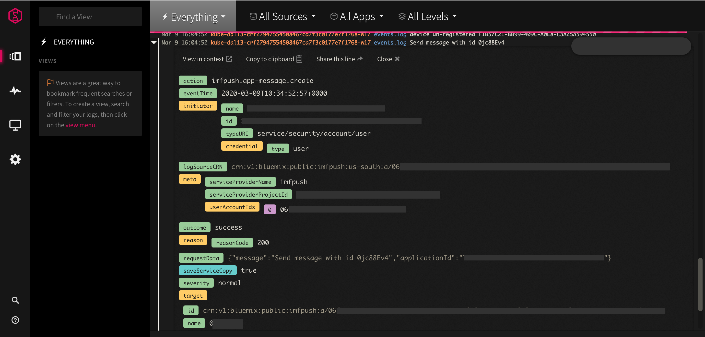

---

copyright:
  years: 2016, 2020
lastupdated: "2020-04-08"

keywords: activity tracker for Push Notifications service, LogDNA for Push Notifications service, Push Notifications service events, Push Notifications service security, audit logs for Push Notifications service, viewing Push Notifications service events, Push Notifications service events

subcollection: mobile-pushnotification

---

{:external: target="_blank" .external}
{:shortdesc: .shortdesc}
{:codeblock: .codeblock}
{:pre: .pre}
{:screen: .screen}
{:tsSymptoms: .tsSymptoms}
{:tsCauses: .tsCauses}
{:tsResolve: .tsResolve}
{:tip: .tip}
{:important: .important}
{:note: .note}
{:download: .download}
{:table: .aria-labeledby="caption"}
{:java: .ph data-hd-programlang='java'}
{:ruby: .ph data-hd-programlang='ruby'}
{:c#: .ph data-hd-programlang='c#'}
{:objectc: .ph data-hd-programlang='Objective C'}
{:python: .ph data-hd-programlang='python'}
{:javascript: .ph data-hd-programlang='javascript'}
{:php: .ph data-hd-programlang='PHP'}
{:swift: .ph data-hd-programlang='swift'}
{:reactnative: .ph data-hd-programlang='React Native'}
{:csharp: .ph data-hd-programlang='csharp'}
{:ios: .ph data-hd-programlang='iOS'}
{:android: .ph data-hd-programlang='Android'}
{:cordova: .ph data-hd-programlang='Cordova'}
{:xml: .ph data-hd-programlang='xml'}

# Auditing events for {{site.data.keyword.mobilepushshort}} service
{: #at_events}

As a security officer, auditor, or manager, you can use the Activity Tracker service to track how users and applications interact with the {{site.data.keyword.mobilepushshort}} service in {{site.data.keyword.cloud}}. You can view, manage, and audit actions or events such as device registration, device subscription, and application configuration can be tracked for {{site.data.keyword.mobilepushshort}} service. 
{: shortdesc}

{{site.data.keyword.at_full_notm}} records user-initiated activities that change the state of a service in {{site.data.keyword.cloud_notm}}. You can use this service to investigate abnormal activity and critical actions and to comply with regulatory audit requirements. In addition, you can be alerted about actions as they happen. The events that are collected comply with the Cloud Auditing Data Federation (CADF) standard. For more information, see the [getting started tutorial for {{site.data.keyword.at_full_notm}}](https://cloud.ibm.com/docs/services/Activity-Tracker-with-LogDNA?topic=logdnaat-getting-started).

## List of events by {{site.data.keyword.mobilepushshort}} service
{: #at_actions}

The following table lists the {{site.data.keyword.cloudaccesstrailfull}} events for {{site.data.keyword.cloud_notm}} {{site.data.keyword.mobilepushshort}} service:

|Action                             |Description                        |
|-----------------------------------|-----------------------------------|
|imfpush.app.update                 |Updates to the Application         |
|imfpush.app-conf.update            |Application configuration update   |
|imfpush.app-conf.delete            |Application configuration deletion |
|imfpush.app-device.create          |Device registration                |
|imfpush.app-device.delete          |Device unregistration              |
|imfpush.app-tag.create             |Tag creation                       |
|imfpush.app-tag.update             |Tag update                         |
|imfpush.app-tag.delete             |Tag deletion                       |
|imfpush.app-subscription.create    |Device subscription for a tag      |
|imfpush.app-subscription.delete    |Device unsubscription for a tag    |
|imfpush.app-message.create         |Send message                       |
|imfpush.app-webhook.create         |Webhook creation                   |
|imfpush.app-webhook.update         |Webhook update                     |
|imfpush.app-webhook.delete         |Webhook deletion                   |
{: caption="Table 1. List of actions that genererate an event" caption-side="top"}

Currently, the {{site.data.keyword.cloudaccesstrailshort}} Events for {{site.data.keyword.cloud_notm}} {{site.data.keyword.mobilepushshort}} service are available only on `Dallas, Washington DC, London, Sydney, and Tokyo`.
{: note}

## Viewing events
{: #at_ui}

Events that are generated by an instance of the {{site.data.keyword.mobilepushshort}} service are automatically forwarded to the {{site.data.keyword.at_full_notm}} service instance that is available in the same location.

{{site.data.keyword.mobilepushshort}} service manages Activity Tracker using the same common Dallas instance for Washington DC and Dallas and makes use of tags which lets events filter based on region.
{: note}

{{site.data.keyword.at_full_notm}} can have only one instance per location. To view events, you must access the web UI of the {{site.data.keyword.at_full_notm}} service in the same location where your service instance is available. For more information, see [Launching the web UI through the IBM Cloud UI](https://cloud.ibm.com/docs/services/Activity-Tracker-with-LogDNA?topic=logdnaat-launch#launch_step2).

## Analyzing events
{: #at_events_iam_analyze}

{{site.data.keyword.at_full_notm}} compiles all of your logs at an account level, which means that all of your services are shown in the same instance, per region. If you have an app that runs in Dallas and another app that runs in London, the events will be found in the respective instances of Activity Tracker.

**Prerequisite**: You need to have an instance of {{site.data.keyword.at_full_notm}} in the region where you would like to track events.

1. Log in to your IBM Cloud account.
1. In the IBM Cloud console navigation, click **Observability**.
1. Select **Activity Tracker** from the **Observability** navigation.
1. Select the instance of Activity Tracker that correlates to the region for which you want to see events.
1. Click **View LogDNA**. When the dashboard loads, you'll see an overview of all of the activity that is covered by that instance of Activity Tracker with LogDNA. You can use the search operators to filter the events by tags, sources, apps, or levels. You can also search for specific events or jump to a specific timeframe.
1. To see events for a specific application, select the app that you want to track from the **All Apps** drop-down. To help meet compliance regulations, you can choose to retain your events or archive them into [IBM Cloud Object Storage](https://www.ibm.com/cloud/object-storage).

   

   Figure 1: View of your Activity Tracker instance with a sample audit event.
