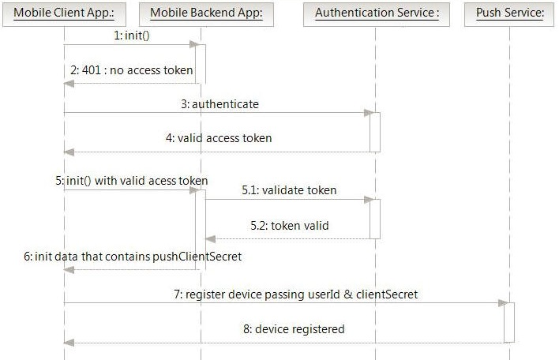

---

copyright:
  years: 2015, 2020
lastupdated: "2020-06-24"

keywords: push notification, push notifications, notification, security, api keys, clientSecret

subcollection: mobilepush

---

{:external: target="_blank" .external}
{:shortdesc: .shortdesc}
{:codeblock: .codeblock}
{:pre: .pre}
{:screen: .screen}
{:tsSymptoms: .tsSymptoms}
{:tsCauses: .tsCauses}
{:tsResolve: .tsResolve}
{:tip: .tip}
{:important: .important}
{:note: .note}
{:download: .download}
{:java: .ph data-hd-programlang='java'}
{:ruby: .ph data-hd-programlang='ruby'}
{:c#: .ph data-hd-programlang='c#'}
{:objectc: .ph data-hd-programlang='Objective C'}
{:python: .ph data-hd-programlang='python'}
{:javascript: .ph data-hd-programlang='javascript'}
{:php: .ph data-hd-programlang='PHP'}
{:swift: .ph data-hd-programlang='swift'}
{:reactnative: .ph data-hd-programlang='React Native'}
{:csharp: .ph data-hd-programlang='csharp'}
{:ios: .ph data-hd-programlang='iOS'}
{:android: .ph data-hd-programlang='Android'}
{:cordova: .ph data-hd-programlang='Cordova'}
{:xml: .ph data-hd-programlang='xml'}

# Security in {{site.data.keyword.mobilepushshort}} 
{: #security-in-push-notifications}

The {{site.data.keyword.mobilepushshort}} APIs are secured by -
- **clientSecret** - The `clientSecret` protects APIs that are typically started by mobile client applications. There is only one API related to registration of a device with an associated UserId that requires this `clientSecret`. None of the other APIs started from mobile clients require the `clientSecret`. 
- **API Keys** - Application programming interface keys (API keys) are available through Cloud IAM for you to use to authenticate by using API or CLI as a user or service ID. These API keys are provided through Cloud IAM and therefore cannot be used generally to authenticate with IBMid outside of {{site.data.keyword.cloud_notm}}. 

The `clientSecret` is used as authentication mechanism when a client SDK connects to the {{site.data.keyword.mobilepushshort}} service. API Keys are used as the authentication mechanism for the management APIs. 
{: note}

## `clientSecret` for user authentication
{: #push-client-secret}

The `clientSecret` is allocated to every service instance at the time of creation of {{site.data.keyword.mobilepushshort}} service. The `clientSecret` is available in the **Service Credentials** section. Refer to the [ReST API](https://eu-gb.imfpush.cloud.ibm.com/imfpush/) documentation for information on how the secrets are to be passed and for what APIs.

By default, client secret verification is enforced only in new apps. Both existing and new apps are allowed to enable or disable the client secret verification by using the `verifyClientSecret` REST API. It is suggested that you enforce client secret verification to avoid exposing devices to users who might know the applicationId and deviceId.

Earlier applications were required to pass the `clientSecret` only when registering or updating devices with `userId` field. All other APIs called by mobile and browser clients did not require `clientSecret`. These old applications can continue to use the `clientSecret` optionally for device registrations or updating calls. However, it is recommended that `clientSecret` check is enforced for all client API calls. To enforce this in existing applications, there is a new `verifyClientSecret` API that is published. For new applications, clientSecret check is enforced on all client API calls and this behavior cannot be changed with the `verifyClientSecret` API.
{: note}

Ensure that the `clientSecret` is kept confidential and never hardcoded into the mobile app. There are various application initialization patterns that can be used to pull in the `clientSecret` dynamically during the applications runtime. The sequence diagram outlines on such possible pattern.

 

## API keys for user authentication
{: #push-api-key}

An API key is a unique code that is passed in to an API to identify the calling application or user. API keys are used to track and control how the API is being used, for example to prevent malicious use or abuse of the API. The API key often acts as both a unique identifier and a secret token for authentication, and generally has a set of access permissions specific to the identity associated with it.

Refer [here](https://cloud.ibm.com/docs/iam?topic=iam-manapikey) for more details on managing and working with API keys.
