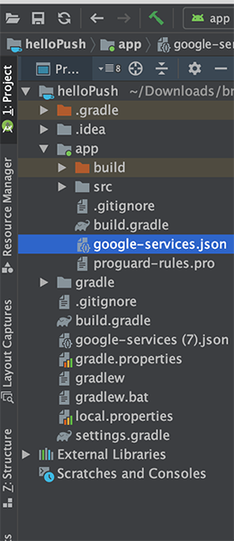
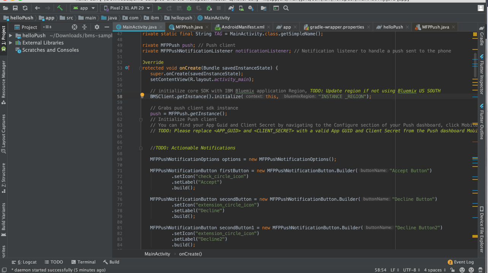
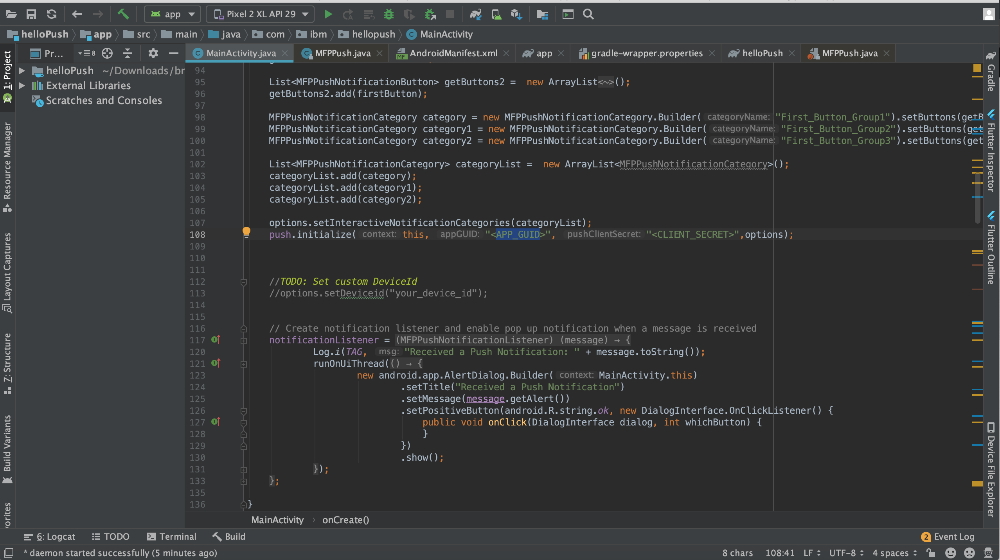

---

copyright:
  years: 2015, 2020
lastupdated: "2020-05-04"

keywords: push notifications, setup client sdk, android application, cordova application, iOS application, web browser

subcollection: mobile-pushnotification

---

{:external: target="_blank" .external}
{:shortdesc: .shortdesc}
{:codeblock: .codeblock}
{:pre: .pre}
{:screen: .screen}
{:tsSymptoms: .tsSymptoms}
{:tsCauses: .tsCauses}
{:tsResolve: .tsResolve}
{:tip: .tip}
{:important: .important}
{:note: .note}
{:download: .download}
{:java: .ph data-hd-programlang='java'}
{:ruby: .ph data-hd-programlang='ruby'}
{:c#: .ph data-hd-programlang='c#'}
{:objectc: .ph data-hd-programlang='Objective C'}
{:python: .ph data-hd-programlang='python'}
{:javascript: .ph data-hd-programlang='javascript'}
{:php: .ph data-hd-programlang='PHP'}
{:swift: .ph data-hd-programlang='swift'}
{:reactnative: .ph data-hd-programlang='React Native'}
{:csharp: .ph data-hd-programlang='csharp'}
{:ios: .ph data-hd-programlang='iOS'}
{:android: .ph data-hd-programlang='Android'}
{:cordova: .ph data-hd-programlang='Cordova'}
{:xml: .ph data-hd-programlang='xml'}

# Set up service client SDK's
{: #push_step_3}

Ensure that you have [obtain notification service provider credentials](/docs/services/mobilepush?topic=mobile-pushnotification-push_step_1) and have [configured a push service instance](/docs/services/mobilepush?topic=mobile-pushnotification-push_step_2). You then need to set up the application for using {{site.data.keyword.mobilepushshort}} service to register, subscribe, and receive push notifications. 

To set up the service client SDK, go through the following steps based on your application type.

## On Android applications
{: #push_step_3_Android}

You can enable Android applications to receive push notifications to your devices. Android Studio is a prerequisite and is the recommended method to build Android projects. Basic knowledge of Android Studio is essential.

Ensure that you have gone through [Obtain notification service provider credentials](/docs/services/mobilepush?topic=mobile-pushnotification-push_step_1) to set up the FCM project and obtain your credentials.

Complete the steps for [{{site.data.keyword.mobilepushshort}} Android SDK](https://github.com/ibm-bluemix-mobile-services/bms-clientsdk-android-push/tree/master) to enable Android apps to receive push notifications sent from the service. 

1. Follow this [documentation](https://github.com/ibm-bluemix-mobile-services/bms-clientsdk-android-push/tree/master#installation) to install SDK for your Android app.

1. Open the app in Android Studio. Copy the `google-services.json` file that you have created through [Obtain your credentials](/docs/services/mobilepush?topic=mobile-pushnotification-push_step_1) to your Android application module root directory. Note that the `google-service.json` file includes the added package names.

   

1. [Initialize core SDK and Push SDK](https://github.com/ibm-bluemix-mobile-services/bms-clientsdk-android-push/tree/master#include-core-sdk-and-push-sdk).
   - Initialize core SDK with IBM Cloud application region in your app Main Activity file. If you don't have an app, get a [sample app](https://github.com/ibm-bluemix-mobile-services/bms-samples-android-hellopush/) to test it out.

      

   - Initialize Push SDK by copying APP GUID and CLIENT SECRET from **Service credentials** page for the Push Notification service on IBM Cloud.

      

      Paste the APP GUID and CLIENT SECRET under your app’s Main Activity file.

      

1. If you have an android device, connect to your mac/windows and select the device in the Android studio.
1. Click on the run button. If you don't have an android device, [create an emulator](https://developer.android.com/studio/run/emulator) with API 28 or above.
1. Run the app and click on Register device button which appears on your app for the push notifications.

Your next step is to [Send a notification](/docs/services/mobilepush?topic=mobile-pushnotification-push_step_4).

## On Cordova applications
{: #push_step_3_Cordova}

Cordova is a platform for building hybrid applications with JavaScript, CSS, and HTML. The {{site.data.keyword.mobilepushshort}} service supports development of Cordova-based iOS and Android applications.

To enable Cordova applications to receive, push notifications to your devices, you need to configure the [Cordova plug-in Push SDK](https://github.com/ibm-bluemix-mobile-services/bms-clientsdk-cordova-plugin-push/tree/master#ios-app).

After setting up the Cordova plug-in Push SDK, the next step is to [Send a notification](/docs/services/mobilepush?topic=mobile-pushnotification-push_step_4).

## On iOS applications
{: #push_step_3_iOS}

To enable iOS applications to receive {{site.data.keyword.mobilepushshort}} to your devices, you need to configure the [iOS SDK for Push Notifications service](https://github.com/ibm-bluemix-mobile-services/bms-clientsdk-swift-push/tree/master#setup-client-application). 

After setting up the iOS SDK, your next step is to [Send a notification](/docs/services/mobilepush?topic=mobile-pushnotification-push_step_4).

## On Web browsers
{: #push_step_3_web}

To enable your browser applications to receive, push notifications, you need to configure the [Web SDK for Push Notifications service](https://github.com/ibm-bluemix-mobile-services/bms-clientsdk-javascript-webpush/blob/master/README.md).

After setting up the Web SDK, your next step is to [Send a notification](/docs/services/mobilepush?topic=mobile-pushnotification-push_step_4).
